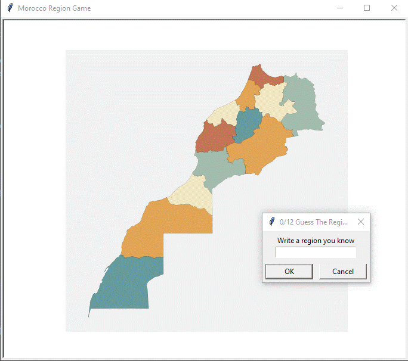
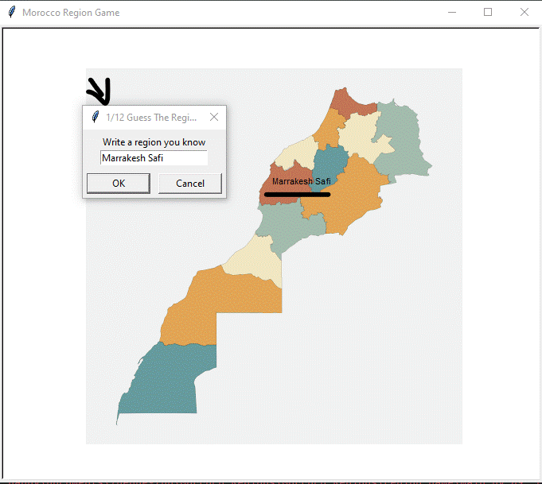
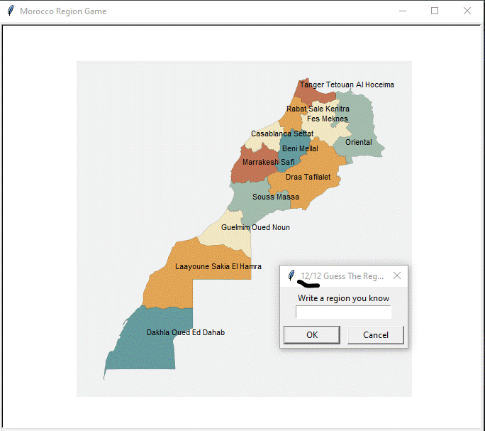

# Morroco_Regions
As a beginner, this project was a fantastic opportunity to combine data analysis with game development, and I'm proud of the result! It allowed me to enhance my programming skills and creativity while exploring the rich geography of Morocco.


## demo









## command line
If you want to try the game use this
```
git clone https://github.com/ThexOnex/Morroco_Regions.git
cd Morroco_Regions
cd region_game
python main.py
```

